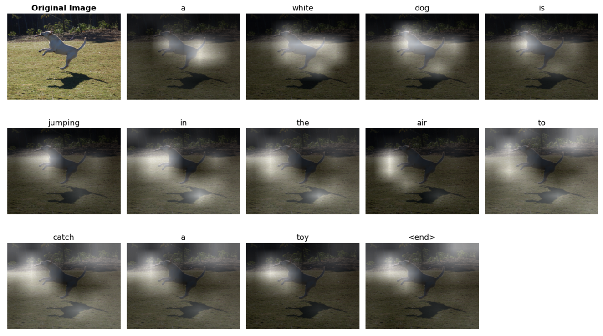
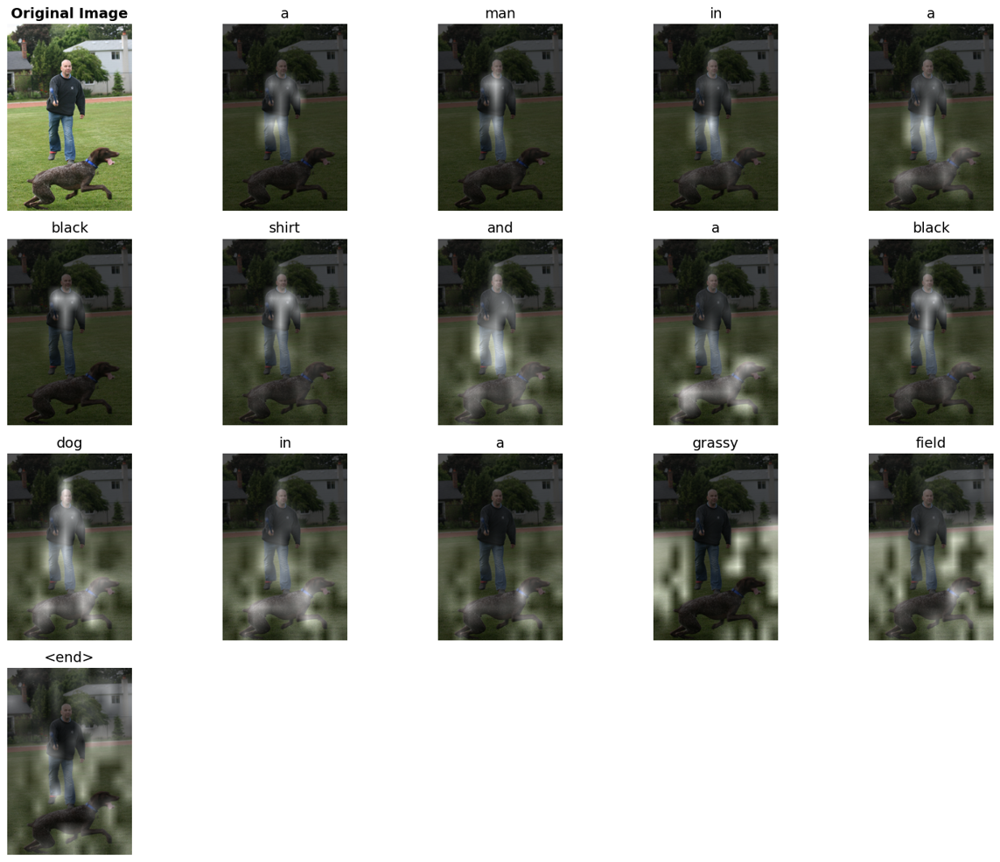

# Re-implementation: Show, Attend and Tell

A re-implementation of **"Show, Attend and Tell: Neural Image Caption Generation with Visual Attention"** (Xu et al., 2015) as part of Cornell CS 4782 (Deep Learning).

---

## Introduction

This repository re-implements the paper *Show, Attend and Tell: Neural Image Caption Generation with Visual Attention* by Xu et al. (2015), which introduced **visual attention mechanisms for image captioning**. The paper's main contribution is showing that an LSTM decoder can learn to selectively attend to different spatial regions of an encoded image while generating each word, producing more accurate captions and yielding interpretable attention maps as a by-product.

---

## Chosen Result

We targeted **Table 1** of the original paper: BLEU-1 through BLEU-4 scores for soft and hard attention on the **Flickr8k** benchmark. This result is central to the paper's claim that attention — especially stochastic hard attention — meaningfully improves caption quality over non-attentive baselines.

> *Xu et al., Table 1 — Flickr8k BLEU scores:*
> | Model | BLEU-1 | BLEU-2 | BLEU-3 | BLEU-4 |
> |---|---|---|---|---|
> | Paper — Soft Attention | 67.0 | 44.8 | 29.9 | 19.5 |
> | Paper — Hard Attention | 67.0 | 45.7 | 31.4 | 21.3 |

---

## GitHub Contents

```
show-attend-tell/
├── code/
│   ├── main.ipynb              # End-to-end training & evaluation notebook (Colab)
│   ├── config.py               # Hyperparameters and paths
│   ├── models/                 # Encoder (ResNet50, ViT), Decoder (LSTM, Transformer), Attention
│   ├── datasets/               # Flickr8k loader and vocabulary utilities
│   ├── eval/                   # BLEU/METEOR metrics, greedy decode, corpus predictions
│   └── training/               # Training loops (soft & hard attention), checkpointing
├── data/
│   ├── flickr8k/               # Images and captions (downloaded via kagglehub)
│   └── get_flickr8k.py         # Dataset download script
├── results/                    # Attention heatmaps, BLEU comparison table, training logs
├── poster/                     # Project poster PDF
└── requirements.txt
```

---

## Re-implementation Details

**Approach:** We faithfully re-implemented the ResNet50 + LSTM soft/hard attention pipeline from the paper, then extended it with a ViT encoder and a Transformer decoder to study how modern architectures interact with the attention mechanism.

| Component | Details |
|---|---|
| **Dataset** | Flickr8k — 8,000 images, 5 captions each; 90/10 train/val split |
| **Vocabulary** | 10,000 most-frequent tokens + `<start>`, `<end>`, `<pad>`, `<unk>` |
| **Encoders** | ResNet50 (frozen, 7×7 spatial grid, 2048-dim); ViT-B/16 (frozen, 196 patches, 768-dim) |
| **Decoders** | LSTM with soft attention (Eq. 13 from paper); LSTM with hard attention (REINFORCE); Transformer decoder |
| **Optimizer** | Adam, lr = 3×10⁻⁴, gradient clipping at 5.0 |
| **Evaluation** | Corpus-level BLEU-1–4 and METEOR via NLTK |

**Challenges & modifications:**
- Hard attention training with REINFORCE required careful entropy regularization (`λ_entropy = 0.01`) and a moving-average baseline to stabilize gradients.
- BLEU-1 scores in our re-implementation are ~7 points lower than the paper's reported values; we attribute this to vocabulary and tokenization differences rather than modeling errors, as BLEU-2 through 4 match closely.

---

## Reproduction Steps

**Requirements:** A CUDA-capable GPU is strongly recommended (experiments were run on Google Colab with an A100/T4). Training soft attention for ~10 epochs takes roughly 1–2 hours on a T4.

1. **Clone the repo**
   ```bash
   git clone <repo-url>
   cd show-attend-tell
   ```

2. **Install dependencies**
   ```bash
   pip install -r requirements.txt
   ```

3. **Download Flickr8k**  
   Set up a Kaggle API token (`~/.kaggle/kaggle.json`), then run:
   ```bash
   python data/get_flickr8k.py
   ```

4. **Run training & evaluation**  
   Open `code/main.ipynb` in Google Colab (or Jupyter with a GPU) and execute all cells. The notebook covers dataset loading, vocabulary building, model training, checkpoint saving, and BLEU evaluation in one end-to-end flow. Switch the `MODEL_TYPE` config variable to select `soft`, `hard`, `vit_lstm`, or `vit_transformer`.

---

## Results / Insights

Our re-implementation closely matches the original paper on Flickr8k, and our ViT + Transformer extension surpasses it:

| Model | BLEU-1 | BLEU-2 | BLEU-3 | BLEU-4 |
|---|---|---|---|---|
| Paper — Soft Attention | 67.0 | 44.8 | 29.9 | 19.5 |
| Paper — Hard Attention | 67.0 | 45.7 | 31.4 | **21.3** |
| **Ours — Soft Attention** | 60.0 | 43.2 | 29.9 | 19.4 |
| **Ours — Hard Attention** | 60.4 | 43.3 | 30.1 | 20.7 |
| **Ours — ViT + LSTM** | 60.5 | 43.4 | 30.4 | 21.2 |
| **Ours — ViT + Transformer** | 61.9 | **45.1** | **32.2** | **22.7** |

Soft attention heatmaps confirm that the model learns interpretable region–word alignments (e.g., attending to a dog when generating "dog"):



The ViT + Transformer model produces sharp, semantically coherent attention maps:



---

## Conclusion

We successfully reproduced the core BLEU results from Xu et al. (within 0.1 BLEU-4 for soft attention), validating the paper's attention mechanism. Our key finding is that substituting modern components — a ViT encoder and Transformer decoder — yields further gains (BLEU-4 of 22.7 vs. the paper's 21.3 for hard attention) without any increase in model complexity, suggesting that the attention idea from the paper generalizes well to contemporary architectures.

---

## References

1. Xu, K., Ba, J., Kiros, R., Cho, K., Courville, A., Salakhutdinov, R., Zemel, R., & Bengio, Y. (2015). *Show, Attend and Tell: Neural Image Caption Generation with Visual Attention.* ICML 2015. [arXiv:1502.03044](https://arxiv.org/abs/1502.03044)
---

## Acknowledgements

This project was completed as a final project for **CS 4782: Deep Learning** at Cornell University (Spring 2026). We thank the course staff for their guidance and feedback throughout the semester.
